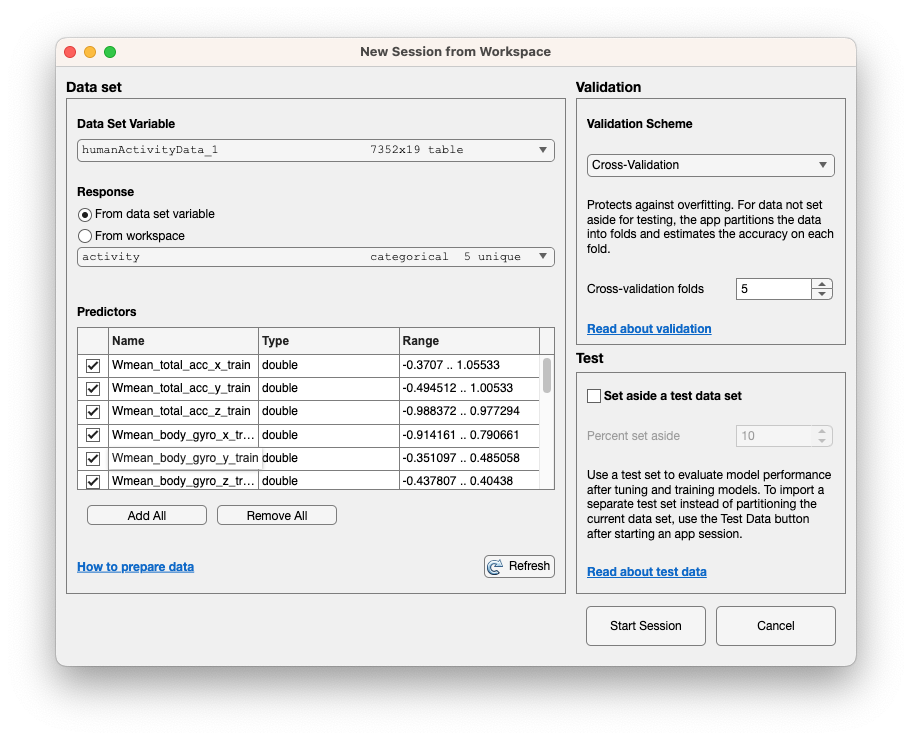

# CS 528 Project 4

Maxine Shi, Sam Bryan, Zack Koval, Reese Haley

## Most Accurate Classifiers and their Accuracy

### 1. Three original features (mean, PCA and Standard deviation)

Neural Network: 96.4% Accuracy

### 2. Three original features (mean, PCA, Standard deviation) and also Average Absolute Difference (i.e. 4 features in total)

SVM: 96.5% Accuracy

### 3. Three original features (mean, PCA, Standard deviation) and also Average Absolute Difference and Average Resultant Acceleration (i.e. 5 features in total)

Tree: 92.8% Accuracy

### 4. Three original features (mean, PCA, Standard deviation), and also Average Absolute Difference, Average Resultant Acceleration and Time Between Peaks (i.e. 6 features in total)

Ensemble: 95.5% Accuracy

### 5. Three original features (mean, PCA, Standard deviation) and also Average Absolute Difference, Average Resultant Acceleration, Time Between Peaks and Binned Distribution (i.e. 7 features in total)

Tree: 93.3% Accuracy

### 6. Three original features (mean, PCA, Standard deviation) and also Interquartilve Range (IQR) (i.e. 4 features in total)

Neural Network: 97.0% Accuracy

### 7. Three original features (mean, PCA, Standard deviation) and Interquartile range (IQR), Mean Absolute Deviation (MAD), Correlation between axes, Entropy, and Kurtosis (i.e. 8 features in total)

SVM: 98.1% Accuracy

### Session 5 with 5% Holdout

SVM: 97.5% Accuracy

### Session 5 with 10% Holdout

Ensemble: 96.2% Accuracy

### Session 5 with 15% Holdout

SVM: 96.2% Accuracy

### Session 5 with 20% Holdout

Ensemble: 96.6% Accuracy

### Session 5 with 25% Holdout

Ensemble: 96.9% Accuracy

### Session 5 with 30% Holdout

Ensemble: 96.2% Accuracy

## Accuracies Ranked

Rank | Feature Set | Classifier | Accuracy
---- | ---- | ---- | ----
1 | 7 | SVM | 98.1%
2 | 6 | Neural Network | 97.0%
3 | 2 | SVM | 96.5%
4 | 1 | Neural Network| 96.4%
5 | 4 | Ensemble | 95.5%
6 | 5 | Tree | 93.3%
7 | 3 | Tree | 92.8%

Feature set 7, containing eight features including the originals, mean, PCA, and standard deviation, along with Interquartile range (IQR), Mean Absolute Deviation (MAD), Correlation between axes, Entropy, and Kurtosis performed the best with SVM and an accuracy of 98.1%.

## Running Mathworks version 2023a

**The GUI has been updated since the tutorial was created in 2015. We thought we should include instructions for using the most current release (2023a).**

To begin, open *classisificationLearner*

Step 1:

Step 2:

Step 3:

Step 4:

Step 5:

(Use the defaults.)

Step 6:

Select "All" in the models panel then "Train All"

 